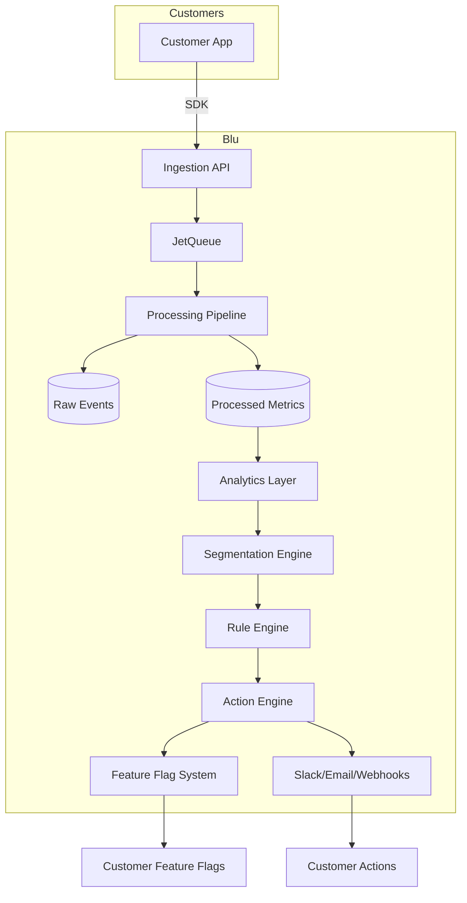

# Blu — Behavioral Analytics & Action Platform

> **Track → Understand → Decide → Act**  
> Blu is a B2B SaaS platform that helps companies turn user behavior into business actions — all in one multi‑tenant system.

---


> [!WARNING]
>This project is **not yet production‑ready**, but the core infrastructure is taking shape.  
> **Status: Development deferred**

We’re building a complete data‑to‑action pipeline that combines:
- Analytics (mixpanel‑like)  
- Feature flags (launchdarkly‑like)  
- Actions & integrations (hightouch‑like)  

**Why you should star this repo** → Because this is the only open‑source platform that does all three in one, with a behavioral engine that auto‑enables features based on user activity.

---

## 🎯 The Goals

### For the Product
- **Multi‑tenant SaaS** – each customer gets isolated data and subdomains
- **Event ingestion** – SDKs for web, mobile, and backend
- **Analytics core** – dashboards, funnels, cohorts, and custom reports
- **Segmentation engine** – dynamic user grouping based on behavior
- **Rule engine** – customer‑defined logic (if‑this‑then‑that for analytics)
- **Action adapters** – feature flags, Slack, webhooks, email
- **Behavioral auto‑flags** – enable features automatically when users hit criteria

### For Developers (this project)
- **Clean architecture** – separation of ingestion, processing, storage, analytics, and actions
- **Async‑first** – all heavy work goes through JetQueue
- **Demo‑mode ready** – can run fully on Vercel’s free tier with mock data
- **SDK‑first** – a stable, versioned SDK for customers
- **Open‑source core** – MIT license, community‑driven

---

## 🏗️ Architecture (Work in Progress)



---

## ⚙️ Key features by the live demo

- [ ] Multi-tenant architecture (enterprise pattern)
- [ ] Real-time analytics dashboard
- [x] Stripe webhook handling
- [ ] Performance optimized (SSR/ISR)
- [ ] Production logging & monitoring
- [ ] Security best practices
- [ ] Rate limiting & bot protection
- [ ] A/B testing framework

---

## 🚧 What's going to be implemented

- [ ] Dynamic segmentation engine (real‑time based on behavioral criteria)
- [ ] Dashboard: charts, funnels, and cohorts
- [ ] Rule builder UI (drag‑and‑drop condition editor)
- [ ] Action engine: full integration with feature flag system
- [ ] Demo mode with seed data for easy testing
- [ ] Reverse ETL adapter (future)

---

## 🛠️ Tech Stack

| Area              | Technology                        |
|-------------------|-----------------------------------|
| Frontend          | Next.js 16, React 19, TailwindCSS |
| Backend           | Next.js API Routes, Node.js       |
| Database          | MongoDB Atlas (multi‑tenant) + SQL for events      |
| Queue             | JetQueue (in‑memory for demo)     |
| Real‑time         | Server‑Sent Events (SSE)          |
| Deployment        | Vercel (serverless)               |
| Authentication    | JWT (stateless)(for demo)         |
| SDK               | TypeScript, React hooks, Node.js  |
| Testing           | Cypress, Vitest                   |

---

## 🚀 Getting Started (Local Dev)

```bash
# Clone
git clone https://github.com/arxja/blu.git
cd blu

# Install dependencies
pnpm install

# Set up environment
cp .env.example .env.local

# Start MongoDB (or use Atlas)
docker run -d -p 27017:27017 mongo:6

# Seed demo data (optional)
pnpm db:seed

# Run dev server
pnpm dev
```

Environment variables (`.env.local`):

```env
# check the central config schema for more info
MONGODB_URI=mongodb://localhost:27017/blu
JWT_SECRET=your_jwt_secret
NEXT_PUBLIC_APP_URL=http://localhost:3000
DEMO_MODE=true
```

---

## 📋 Roadmap

| Phase | Focus | Estimated |
|-------|-------|-----------|
| **1. Foundation & Core** | Ingestion, storage, basic analytics, codebase, SaaS app general features | 🚧 In Progress |
| **2. Intelligence** | Segmentation, rule engine, behavioral flags | 📋 Next |
| **3. Actions** | Feature flag integration, Slack, webhooks | 📋 Future |
| **4. Scale** | Reverse ETL, enterprise features, on‑prem | 📋 Future |

---

## 🤝 Contributing

We welcome contributions! Even if you just **star the repo** – it helps a lot.

Areas where help is most welcome:
- 📊 Dashboard UI/UX
- 🔧 Integration adapters (new actions)
- 🧪 Tests & documentation
- 🌐 Internationalization

See [CONTRIBUTING.md](CONTRIBUTING.md) for guidelines.

---

## 📄 License

MIT © Blu Analytics

---

## 🔗 Links

- **Live Demo (coming soon):** will be online very soon
- **Documentation:** [docs.blu.dev](https://docs.blu.dev) (in progress)
<!-- - **Community:** [Discord](https://discord.gg/blu) (join to follow progress) -->

---

## ⭐ Why You Should Star This Repo

- **Only open‑source platform combining analytics + flags + actions**
- **Behavioral auto‑flags** – a feature not found in any competitor
- **Clean, modern architecture** – learn from a real‑world SaaS codebase
- **Active development** – we’re shipping fast and need early adopters
